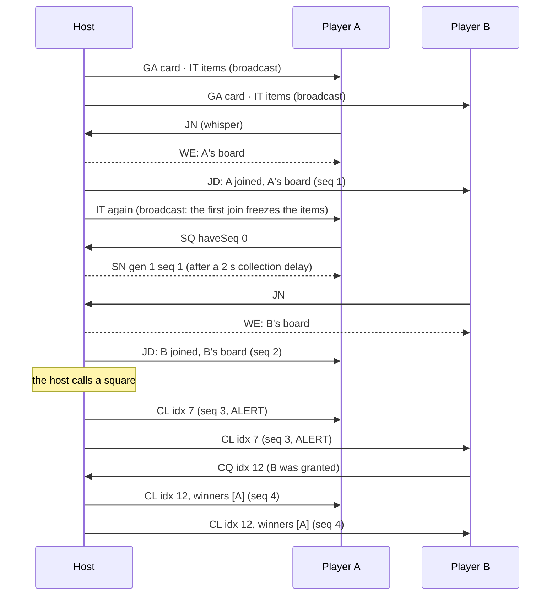
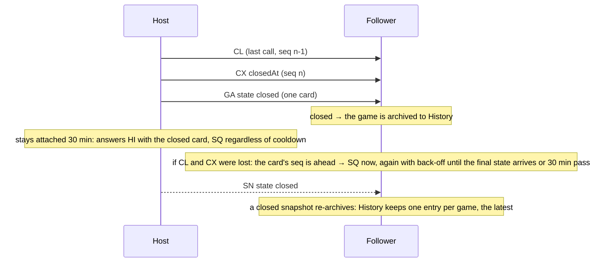

# The DEA Bingo protocol

How one game travels between clients. Everything here is read from the code; where the two
disagree, the code wins and this file needs a fix. The schema in `Core/Codec.lua` is the
source of truth for message shapes, `Core/Net.lua` for trust and rate rules, `Core/Host.lua`
and `Core/Mirror.lua` for behaviour and timing.

## One rule

The owner's client is the **host** and the only writer of a game's state. Every other client
is a **mirror**: it applies what the host broadcasts, in sequence, and asks the host for a
snapshot when it falls behind. Authority never comes from a payload field. It comes from the
**server-stamped sender** of the message, which no client can forge.

## Wire format

Messages travel as addon messages under one prefix, `DEABINGO`, through AceComm, which
chunks and reassembles them. One message is one line:

    <protocol>\31<type>\31<gid>\31<field>\31<field>...

| Piece | Rule |
| --- | --- |
| protocol | An integer, currently `2`. A message from a **newer** protocol is not parsed; the client notes once that a newer release is in use. An older one is parsed if its fields still fit. |
| type | Two upper-case letters, listed below. Unknown types are dropped. |
| gid | Game id: up to 24 characters of `[A-Za-z0-9-]`. The host mints it from the server time in base 36 plus two random characters. `0` is the hello, which belongs to no game. |
| fields | Positional, in schema order. Lists inside a field are joined with `\30`. |

Both separators are control characters, and `Logic.cleanText` strips every control character
from every piece of player text before it is used, so no title, item or name can contain one.

Every field is validated against its kind on decode, and a message with one bad field is
dropped whole. The kinds:

| Kind | Accepts |
| --- | --- |
| int(min, max) | A finite integer in range. Sequence numbers are `0..2^31`; times are server seconds `0..2^40`; square indices are `0..23`. |
| flag | `0` or `1`. |
| text(max) | Already clean (cleanText leaves it unchanged), within `max` UTF-8 characters. Titles 40, items 60. |
| name | `Name` or `Name-Realm`, up to 64 bytes, no control characters, pipes or doubled spaces. Forever names may contain one space ("Dea One"). |
| board | 24 letters, `A`..`X`, one per cell in reading order with the free centre skipped: the item index at that cell. |
| hash | 6 base-36 characters: `Codec.itemsHash(title, items)`, a djb2 checksum. It proves a set is the one meant, not who sent it (see "Items"). |
| enum | One of a fixed list: game state `open`/`closed`, audience `G` (guild) / `R` (raid or party). |
| list(kind, max) | `\30`-joined values of one kind; a roster list carries up to 200 rows, a call list up to 24. |

A reassembled payload longer than 8000 bytes is dropped before parsing. Indices are 0-based
on the wire, as on the website the rules come from.

## Message types

Direction is who sends to whom. "Broadcast" is the game's audience channel: `GUILD`, or the
group channel (`RAID`, `PARTY` or `INSTANCE_CHAT`, whichever the client is in). "Whisper"
is a direct message to one name. A sequenced message carries the host's `seq`, which goes
up by one per state change; a mirror applies it only in order.

### Discovery

| Type | From → to | Fields | Meaning |
| --- | --- | --- | --- |
| `HI` | anyone → broadcast | ver, nonce, addon | "Who is hosting?" Every host that hears it answers with its card by whisper. The echo of our own hello, recognised by the nonce, teaches the client what the server calls it (see "Identity"). |
| `GA` | host → broadcast, or whisper to a `HI` | gen, seq, state, title, owner, players, callMask, lastActivity, itemsHash, createdAt, audience, addon, minAddon | The card: everything a lobby shows, plus enough for a joined mirror to know whether it is behind (`seq`, `callMask`). Sent on open, every 30 s while open, once on close, and in answer to hellos for 30 min after closing. `minAddon` is the oldest release the host admits. |
| `NV` | mirror → host (whisper) | ver | "I saw a newer protocol than mine." Logged by the host; one notice per session. |

### Joining

| Type | From → to | Fields | Meaning |
| --- | --- | --- | --- |
| `JN` | joiner → host (whisper) | ver | Ask for a board. Refused silently when the game is closed, full (120), the sender is outside the audience, or the sender's release is older than `minAddon`. |
| `WE` | host → joiner (whisper) | seq, board, canCall, createdAt, bingoAt, itemsHash, gen | Your board. The same board again for a returning player. Honoured by the joiner only within 30 s of its own `JN`, and only from the host it asked. |
| `JD` | host → broadcast (sequenced) | seq, name, board, canCall, bingoAt | Someone joined; everyone learns their board, so standings can be computed locally. |
| `IT` | host → broadcast, or whisper to an `IQ` | itemsHash, title, items | The 24 squares and the title. Broadcast at open and once more at the first join (which freezes the items); whispered on request. |
| `IQ` | mirror → host (whisper) | itemsHash | "Send me the squares for this hash." |

### Play

| Type | From → to | Fields | Meaning |
| --- | --- | --- | --- |
| `CQ` | granted caller → host (whisper) | idx, undo, nonce | Ask the host to call or undo a square. The host decides; an unanswered request is reported lost after 5 s. |
| `CL` | host → broadcast (sequenced) | seq, idx, t, winners | A square is called at time `t`; `winners` are the names whose bingo this call completed. |
| `UN` | host → broadcast (sequenced) | seq, idx, t, revoked | A call is taken back; `revoked` are the names whose bingo no longer stands. |
| `GR` | host → broadcast (sequenced) | seq, name, canCall | A player may (or may no longer) call squares through the host. |
| `TI` | host → broadcast (sequenced) | seq, title | The title changed. |
| `CX` | host → broadcast (sequenced) | seq, closedAt | The game is over. Followed by one closed card. |
| `TR` | host → broadcast (sequenced) | seq, gen, newHost | The game is handed to `newHost`, who becomes the host at generation `gen`. |

### Sync

| Type | From → to | Fields | Meaning |
| --- | --- | --- | --- |
| `SQ` | mirror → host (whisper) | haveSeq | "I am at `haveSeq`; send me the state." |
| `SN` | host → requester (whisper), or broadcast for a burst | gen, seq, state, title, owner, createdAt, lastActivity, closedAt, itemsHash, audience, roster, calls, part, of | The whole game. The roster is split 40 rows per part; every part repeats the scalars and the calls, and a mirror applies the snapshot once all `of` parts have arrived. |

## Sequencing and authority

- **Generation** (`gen`) changes only when the host changes: a handoff, or a takeover of a
  silent host. A card or snapshot from a higher generation wins outright; one from a lower
  generation is ignored.
- **Sequence** (`seq`) goes up by one per sequenced message within a generation. A mirror
  applies `seq + 1` at once and buffers up to 64 later ones. A buffered message starts the
  **gap clock**: after 3 s the mirror asks for a sync, then doubles the wait each time up to
  60 s while the gap persists. Anything at or below the current `seq` is noise.
- A **snapshot** of the same generation with a lower `seq` than the mirror holds is dropped
  before its parts are collected: snapshots travel at BULK priority and calls at ALERT, so a
  sync answer can arrive after newer calls.
- **Who may send what.** `JN`, `CQ`, `IQ`, `SQ` and `NV` go only to the host object of
  that game. Everything else about a game is accepted by a mirror only from the game's owner,
  or from a sender allowed to take over: the one the owner named in `TR`, or any roster
  member once the host's card has been silent for 90 s, in both cases with a higher `gen`.
- **Whispers** are accepted only from guild or group members. A card alone earns a sender
  nothing; it has to be the owner of a game this client joined or is joining.
- **Our own echoes** are ignored, with one exception: the hello (below).
- Every mirror sees every player's board (`WE`, `JD`, `SN`), so standings and bingo are
  computed locally from the calls. Boards are dealt by the host and stored, never derived
  from a seed.

## Identity

The server stamps the sender on every message, and that stamp is the identity. The client's
own name APIs can disagree with it (Forever splits "Dea One" into a first name and a
surname), so the client learns what the server calls it from the **echo of its own hello**:
a `HI` carrying its own nonce, within 5 s of sending it.

The nonce is public, so a stranger can replay the hello under their own real name. The
learned name is therefore accepted only when it **is** this character: the same name, realm
and case aside, with spaces kept. "Dea Onex", "Deaone" and a bare "Dea" are all refused,
and a client that only knows its first name learns nothing until it knows more. On classic
realms the realm is part of the test, and an unknown realm refuses everything. The lenient
comparison that tolerates a missing surname is used only for matching the client's own saved
records, never for changing who it is.

## Items

A game's squares are identified by `itemsHash`. A mirror fills its board from a cached set
when it can, to spare the host a whisper per joiner, and asks with `IQ` otherwise. Because the
hash is a short checksum that collides easily, a cached set is trusted only when:

1. recomputing the hash from its title and items gives the advertised hash, **and**
2. the set is on record as coming from the game's owner: the server-stamped sender of the
   `IT` that carried it, in memory and in the saved library alike.

A set with no host on record is fetched again from the owner.

## Flows

### A night: open, join, play



### Falling behind and catching up

```mermaid
sequenceDiagram
  participant H as Host
  participant F as Follower
  H--xF: CL seq 5 (lost)
  H->>F: CL seq 6
  Note over F: seq 6 buffered; gap clock starts (3 s)
  F->>H: SQ haveSeq 4
  Note over H: requests collected for 2 s; one whisper, or one broadcast for several
  H-->>F: SN seq 6 (BULK)
  Note over F: snapshot applied, buffered seq 6 drained, gap clock cleared
  F->>H: SQ (if the snapshot was lost too: 6 s, 12 s, ... up to 60 s)
```

### Handing the game over

```mermaid
sequenceDiagram
  participant O as Old host
  participant N as New host
  participant F as Follower
  O->>N: TR gen 2 newHost N (seq k)
  O->>F: TR gen 2 newHost N (seq k)
  Note over O: handed over: answers SQ and IQ only, no cards, refuses to call
  Note over N: applies TR → promotes itself from its replica
  N->>O: GA gen 2 (first card)
  N->>F: GA gen 2
  Note over O: the new owner's card acknowledges the handoff; retries stop
  Note over O,N: if TR was lost, O resends the same TR after 5 s, 10 s, 20 s, then gives up and says so
  Note over O,F: a follower holding TR behind a gap asks O for a sync; the snapshot names N as owner and promotes N
  Note over O: detached 120 s after the handoff
```

### Closing



### Reload

A client that reloads mid-game has its joined games in the per-character saved file. On the
next hello it hears the card, sends `JN` again and gets the same board back; the welcome and
a snapshot bring it current. A join with no welcome is asked again after 5 s, then 10 s,
then given up with a message. A host that reloads restores its open games from its saved
records and carries on; games closed within the last 30 min come back silently to keep
answering.

## Lockdown

During an encounter the Forever client refuses addon messages. Sends made then are held in a
queue of up to 200, in order, and go out when the lockdown lifts. Only the newest `GA`, `HI`,
`SQ` and `IQ` per destination are kept. Nothing is judged lost or away while the lockdown
lasts; every timer restarts when it lifts, and a held join's welcome window starts when the
join actually leaves.

## Rate limits

Per sender, a token bucket; a sender over its allowance is dropped silently.

| Sender | Allowance |
| --- | --- |
| Anyone | 5 messages, refilling 1 per 2 s |
| A granted caller of a game this client hosts | 20, refilling 2 per s |
| The owner of a game this client joined or is joining | 40, refilling 4 per s |

A lobby-only client is never charged for a host's roster traffic about a game it has not
joined; such messages are ignored before the bucket is touched.

## Timing

| Constant | Value | Meaning |
| --- | --- | --- |
| `Host.HEARTBEAT` | 30 s | Between cards while open |
| `Host.IDLE_CLOSE` | 8 h | Idle time before a game closes itself |
| `Host.SYNC_DELAY` | 2 s | Sync requests collected before one answer |
| `Host.SYNC_COOLDOWN` | 3 s | Per requester, while open; a closed game answers regardless |
| `Host.MAX_PLAYERS` | 120 | Roster cap |
| `Host.SNAPSHOT_ROWS` | 40 | Roster rows per snapshot part |
| `Host.TRANSFER_RETRY` / `TRIES` | 5 s doubling / 3 | Unacknowledged handoff resends |
| `Host.HANDOFF_ANSWERS` | 120 s | The old host answers sync requests after a handoff |
| `Host.CLOSED_ANSWERS` | 30 min | A closed host answers hellos and sync requests |
| `Mirror.CARD_TTL` | 90 s | Silence before a host is shown away |
| `Mirror.CARD_EXPIRY` | 30 min | Away or closed cards leave the lobby |
| `Mirror.GAP_WAIT` / `GAP_WAIT_MAX` | 3 s / 60 s | Sync back-off while a gap persists |
| `Mirror.SYNC_COOLDOWN` | 10 s | Between unforced sync requests per game |
| `Mirror.FINAL_RECOVERY` | 30 min | A follower keeps asking a closed host for the final state |
| `Mirror.JOIN_WINDOW` | 30 s | A welcome is honoured this long after the join |
| `Mirror.JOIN_RETRY` / `JOIN_TRIES` | 5 s doubling / 3 | Join resends before giving up |
| `Mirror.REQUEST_TIMEOUT` | 5 s | An unanswered call request is reported lost |
| `Mirror.MAX_PENDING` | 64 | Buffered out-of-order deltas per game |
| `Mirror.MAX_CARDS` / per host | 50 / 3 | Lobby cards kept |
| `Mirror.TIME_SKEW` | 1 day | A wire time further from now than this is replaced by now |
| `Net.ECHO_WINDOW` | 5 s | Our hello's echo may teach us our name |
| `Net.QUEUE_MAX` | 200 | Sends held through a lockdown |
| `Codec.MAX_PAYLOAD` | 8000 B | Largest reassembled message parsed |

## Versions

`Codec.PROTOCOL` is the wire version. `HI` and `GA` carry the sender's addon release, so
clients on an older release are told a newer one exists. A host may require a minimum release
(`Codec.MIN_ADDON_VERSION`, set per release when a change needs everyone on the same code);
`GA` carries it as `minAddon`, and a joiner below it is told why it cannot join before it
asks. Development builds are never held to it.
